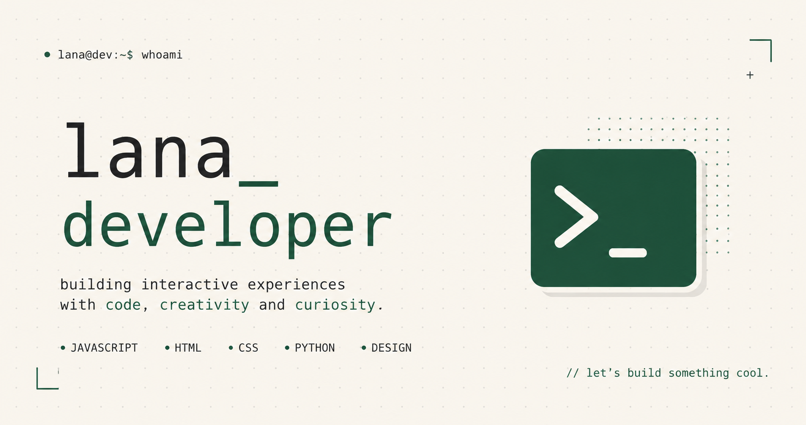

# lana

> interactive portfolio built with vanilla javascript.



## about

this is my personal portfolio.

everything is built from scratch with a focus on interaction instead of animations for the sake of animations.

no frameworks.

just html, css and javascript.

visit → https://www.lannna.ca

---

## features

- draggable letters
- interactive physics
- keyboard sounds
- responsive design
- custom cursor interactions
- handcrafted animations
- lightweight & fast
- zero frameworks

---

## tech

- HTML5
- CSS3
- Vanilla JavaScript

---

## local development

Clone the repository.

```bash
git clone https://github.com/bluenotthecolor/portfolio.git
```

Go into the project.

```bash
cd portfolio
```

Start a local server.

```bash
python -m http.server
```

or

```bash
npx serve
```

Then open

```
http://localhost:8000
```

---

## project structure

```
.
├── assets/
├── css/
├── js/
├── preview.png
├── favicon.ico
├── index.html
└── README.md
```

---

## philosophy

good websites should feel alive.

every interaction should have a purpose.

---

## license

MIT

Feel free to use this project for inspiration, but please don't copy it one-to-one.
